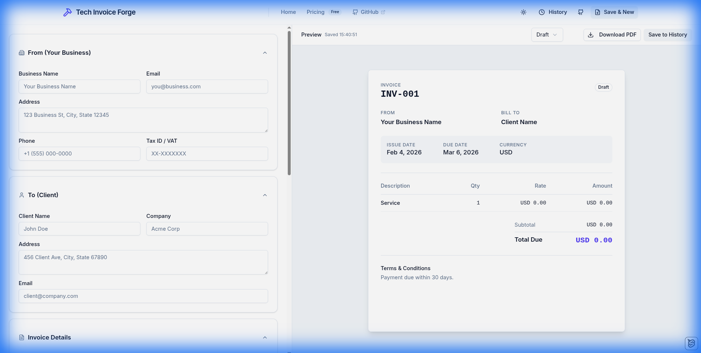
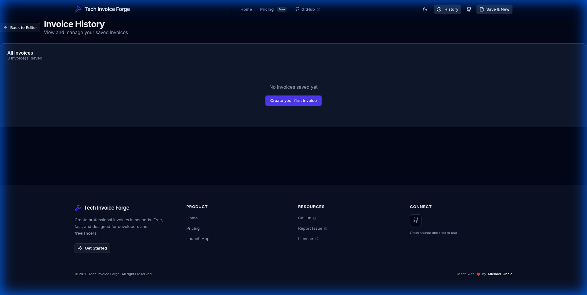

# 🛠️ Tech Invoice Forge (TIF)

[](https://opensource.org/licenses/MIT)
[](https://svelte.dev/)
[](https://tailwindcss.com/)
[](https://bun.sh/)
[](#-architecture)

**Tech Invoice Forge** is a professional-grade, offline-first invoice and receipt generator designed specifically for tech professionals. Unlike bloated SaaS solutions, TIF runs entirely in your browser, providing instant PDF generation without accounts, subscriptions, or backend dependencies.

[**Live Demo**](https://tif.svelte-apps.me) | [**Report Bug**](https://github.com/Michael-Obele/tif/issues) | [**Request Feature**](https://github.com/Michael-Obele/tif/issues)

---



## ✨ Why Tech Invoice Forge?

In a world of account-mandated SaaS, TIF takes a different path: **Zero Friction, Maximum Privacy.**

- **⚡ Zero Setup**: No accounts. No logins. Landing to invoice in under 30 seconds.
- **🛡️ Privacy First**: Your financial data never leaves your machine. 100% client-side.
- **🎨 Slate Professional**: A mature, high-contrast dark theme (no gradients) designed for focus.
- **🏗️ Tech-Tailored**: Pre-configured for software development, consulting, and DevOps services.

---

## 🚀 Key Features

- **Real-time Forge**: Watch your PDF update instantly as you type with our side-by-side preview.
- **Local Persistence**: All invoices and client data are stored in your browser's IndexedDB via `Dexie.js`.
- **Smart Line Items**: Automatic calculations for taxes, discounts, and currency handling.
- **PDF Crafting**: Professional, high-precision PDF generation powered by `pdfmake`.
- **Client Management**: Save and manage your client roster for one-click billing.
- **Responsive Interface**: Built with Tailwind CSS v4 for a seamless experience across all devices.

### Invoice History

*All your invoices are stored locally in your browser.*

---

## 🧰 The Tech Stack

| Category           | Technology                                      |
| :----------------- | :---------------------------------------------- |
| **Framework**      | [Svelte 5 (Runes)](https://svelte.dev/)         |
| **Meta-Framework** | [SvelteKit 2](https://kit.svelte.dev/)          |
| **Styling**        | [Tailwind CSS v4](https://tailwindcss.com/)     |
| **Database**       | [Dexie.js](https://dexie.org/) (IndexedDB)      |
| **PDF Engine**     | [pdfmake](http://pdfmake.org/)                  |
| **Iconography**    | [Lucide Svelte](https://lucide.dev/)            |
| **Components**     | [shadcn-svelte](https://www.shadcn-svelte.com/) |
| **Runtime**        | [Bun](https://bun.sh/)                          |

---

## ⚙️ Getting Started

### Prerequisites

- [Bun](https://bun.sh/) (Recommended) or Node.js 20+

### Installation

```bash
# Clone the repository
git clone https://github.com/Michael-Obele/tif.git

# Navigate to the project directory
cd tif

# Install dependencies
bun install
```

### Development

Start the development server with hot-reloading:

```bash
bun dev
```

Visit `http://localhost:5173` to start forging.

---

## 🏗️ Architecture

TIF uses a **Local-First Architecture**. There is no backend API.

- **Storage**: All data is persisted in the browser's `IndexedDB`.
- **Logic**: Svelte 5 Runes manage reactive state for sub-100ms UI interactions.
- **Validation**: `Valibot` ensures data integrity before persistence.
- **Rendering**: PDF generation is handled in a separate thread/module to maintain 60FPS UI performance.

---

## 🤝 Contributing

Contributions are what make the open-source community an amazing place to learn, inspire, and create.

1. Fork the Project
2. Create your Feature Branch (`git checkout -b feature/AmazingFeature`)
3. Commit your Changes (`git commit -m 'Add some AmazingFeature'`)
4. Push to the Branch (`git push origin feature/AmazingFeature`)
5. Open a Pull Request

---

## 👤 Author

**Michael Obele**
- [GitHub](https://github.com/Michael-Obele)

---

## 📄 License

Distributed under the MIT License. See `LICENSE` for more information.

---

<p align="center">
  Built with ❤️ for the Tech Community by Tech Invoice Forge
</p>
