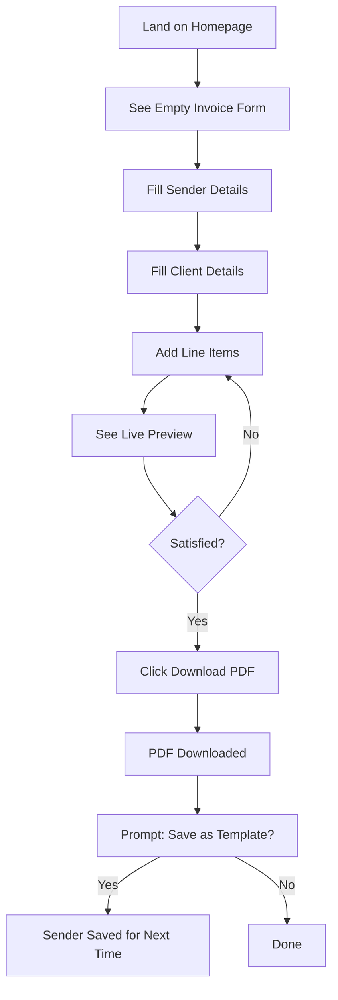
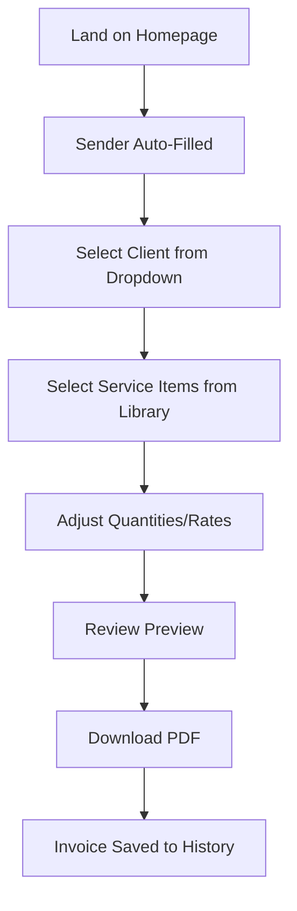
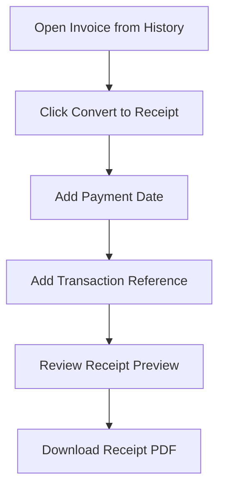

# Tech Invoice Forge - Master Plan

[← Back to Index](./index.md)

---

## Executive Summary

Tech Invoice Forge is a professional-grade, offline-first invoice and receipt generator designed specifically for tech professionals. Unlike bloated SaaS solutions that require accounts and subscriptions, this app runs entirely in the browser with local storage, providing instant PDF generation without any backend dependencies.

---

## Project Goals

### Primary Goals

1. **Zero Friction** - Users can create their first invoice within 30 seconds of landing
2. **Professional Output** - PDFs that rival enterprise invoicing solutions
3. **Privacy First** - No data leaves the browser; everything stored locally
4. **Tech-Tailored** - Templates and line items designed for software services

### Secondary Goals

1. **Fast Performance** - Sub-100ms interactions, instant PDF preview
2. **Accessible** - WCAG 2.1 AA compliant
3. **Mobile Responsive** - Works on tablets and phones
4. **Extensible** - Easy to add new templates and currencies

---

## Target Audience

### Primary: Freelance Tech Professionals

- **Software Developers** billing for projects, milestones, or hourly work
- **Consultants** providing technical advisory services
- **Designers** (UI/UX) working with tech clients
- **DevOps Engineers** on contract engagements

### Secondary: Small Tech Businesses

- **Solo SaaS founders** needing professional receipts
- **Small agencies** (2-5 people) with multiple clients
- **Technical writers** and content creators

### User Pain Points Addressed

| Pain Point                                        | Solution                  |
| :------------------------------------------------ | :------------------------ |
| Complex invoicing tools with account requirements | No signup, instant use    |
| Generic templates not suited for tech work        | Tech-specific templates   |
| Manual calculations and errors                    | Automatic tax and totals  |
| Lost invoices across devices                      | Export/import JSON backup |
| Expensive subscription fees                       | 100% free, forever        |

---

## Feature Breakdown

### Phase 1: MVP (Week 1-2)

#### Core Invoice Creation

- [ ] Invoice form with all essential fields
- [ ] Line item management (add, edit, remove, reorder)
- [ ] Auto-calculation of subtotals, tax, discounts, totals
- [ ] Live PDF preview panel
- [ ] Download PDF button
- [ ] Invoice number generation (auto-increment)

#### Essential Data Fields

**From (Sender):**

- Business name
- Address (multi-line)
- Email
- Phone (optional)
- Tax ID / VAT number (optional)
- Logo upload (optional)

**To (Client):**

- Client name
- Company name (optional)
- Address
- Email

**Invoice Details:**

- Invoice number
- Issue date
- Due date
- Payment terms (Net 15, Net 30, etc.)
- Currency

**Line Items:**

- Description
- Quantity
- Unit (hours, units, flat, etc.)
- Rate
- Tax (per-item or global)
- Amount (calculated)

**Totals:**

- Subtotal
- Discount (% or fixed)
- Tax amount
- Total due

**Additional:**

- Notes section
- Payment instructions
- Terms & conditions

### Phase 2: Enhanced Features (Week 2-3)

#### Data Persistence

- [ ] Save invoices to IndexedDB via Dexie.js
- [ ] Invoice history list with search/filter
- [ ] Draft auto-save
- [ ] Client address book
- [ ] Service/item library (save common items)

#### Templates

- [ ] Classic template (traditional layout)
- [ ] Modern template (minimal design)
- [ ] Tech template (monospace, code-inspired)
- [ ] Compact template (dense, single-page)

#### Receipt Generation

- [ ] Simplified receipt mode
- [ ] Payment confirmation details
- [ ] Transaction reference field

### Phase 3: Polish (Week 3-4)

#### Quality of Life

- [ ] Duplicate invoice feature
- [ ] Edit existing invoices
- [ ] Delete with confirmation
- [ ] Export single invoice as JSON
- [ ] Import invoice from JSON
- [ ] Export all data (full backup)
- [ ] Import full backup
- [ ] Print-optimized CSS

#### Advanced

- [ ] Multi-currency with Intl formatting
- [ ] Currency symbol customization
- [ ] Date format preferences
- [ ] Dark/light theme toggle
- [ ] Keyboard shortcuts

---

## User Flows

### Flow 1: First-Time User Creates Invoice



### Flow 2: Returning User with Saved Data



### Flow 3: Create Receipt from Invoice



---

## Technical Architecture

### Component Hierarchy

```
App
├── Layout
│   ├── Header (Logo, Theme Toggle, Export/Import)
│   └── Main Content
│       ├── InvoiceForm
│       │   ├── SenderSection
│       │   │   ├── BusinessNameInput
│       │   │   ├── AddressTextarea
│       │   │   ├── EmailInput
│       │   │   ├── PhoneInput
│       │   │   ├── TaxIdInput
│       │   │   └── LogoUpload
│       │   ├── ClientSection
│       │   │   ├── ClientSelect (saved clients)
│       │   │   ├── ClientNameInput
│       │   │   ├── CompanyInput
│       │   │   ├── AddressTextarea
│       │   │   └── EmailInput
│       │   ├── InvoiceDetailsSection
│       │   │   ├── InvoiceNumberInput
│       │   │   ├── IssueDatePicker
│       │   │   ├── DueDatePicker
│       │   │   ├── PaymentTermsSelect
│       │   │   └── CurrencySelect
│       │   ├── LineItemsSection
│       │   │   ├── LineItemRow[]
│       │   │   │   ├── DescriptionInput
│       │   │   │   ├── QuantityInput
│       │   │   │   ├── UnitSelect
│       │   │   │   ├── RateInput
│       │   │   │   ├── TaxInput
│       │   │   │   ├── AmountDisplay
│       │   │   │   └── RemoveButton
│       │   │   └── AddLineButton
│       │   ├── TotalsSection
│       │   │   ├── SubtotalDisplay
│       │   │   ├── DiscountInput
│       │   │   ├── TaxTotalDisplay
│       │   │   └── GrandTotalDisplay
│       │   └── NotesSection
│       │       ├── NotesTextarea
│       │       └── TermsTextarea
│       └── PreviewPanel
│           ├── PDFPreview (iframe or canvas)
│           ├── TemplateSelector
│           └── ActionButtons
│               ├── DownloadButton
│               ├── PrintButton
│               └── SaveDraftButton
└── Modals
    ├── ClientModal (add/edit client)
    ├── ServiceModal (add/edit service item)
    ├── HistoryModal (view past invoices)
    └── SettingsModal (preferences)
```

### State Management (Svelte 5 Runes)

```typescript
// $lib/stores/invoice.svelte.ts
class InvoiceState {
	// Sender info (persisted)
	sender = $state<Sender>({
		businessName: '',
		address: '',
		email: '',
		phone: '',
		taxId: '',
		logo: null
	});

	// Current invoice (working document)
	invoice = $state<Invoice>({
		id: null,
		number: '',
		issueDate: new Date(),
		dueDate: null,
		currency: 'USD',
		client: null,
		lineItems: [],
		discount: { type: 'percentage', value: 0 },
		notes: '',
		terms: '',
		status: 'draft'
	});

	// Computed totals
	subtotal = $derived(() => {
		return this.invoice.lineItems.reduce((sum, item) => sum + item.quantity * item.rate, 0);
	});

	taxTotal = $derived(() => {
		return this.invoice.lineItems.reduce(
			(sum, item) => sum + item.quantity * item.rate * (item.taxRate / 100),
			0
		);
	});

	total = $derived(() => {
		const discount =
			this.invoice.discount.type === 'percentage'
				? this.subtotal * (this.invoice.discount.value / 100)
				: this.invoice.discount.value;
		return this.subtotal + this.taxTotal - discount;
	});
}

export const invoiceState = new InvoiceState();
```

---

## Database Schema (Native IndexedDB)

```typescript
// $lib/db/db.native.ts
// The app uses a custom native wrapper found in src/lib/db/db.native.ts
// for zero-dependency local storage.
```

---

## PDF Generation Strategy

### Library: pdfmake

**Why pdfmake?**

- Pure JavaScript, runs entirely in browser
- No server dependency
- Excellent table support (critical for invoices)
- Custom fonts support
- Good documentation
- Used by Easy Invoicer (Svelte reference)

### PDF Document Definition

```typescript
// $lib/pdf/generator.ts
import pdfMake from 'pdfmake/build/pdfmake';
import pdfFonts from 'pdfmake/build/vfs_fonts';

pdfMake.vfs = pdfFonts.pdfMake.vfs;

export function generateInvoicePDF(invoice: Invoice, template: Template): void {
	const docDefinition = {
		pageSize: 'A4',
		pageMargins: [40, 60, 40, 60],

		content: [
			// Header with logo and invoice number
			{
				columns: [
					{ image: invoice.sender.logo, width: 120 },
					{
						text: [
							{ text: 'INVOICE\n', style: 'documentTitle' },
							{ text: invoice.number, style: 'invoiceNumber' }
						],
						alignment: 'right'
					}
				]
			},

			// Sender and Client info
			{
				columns: [
					{
						text: [
							{ text: 'From\n', style: 'sectionLabel' },
							{ text: invoice.sender.businessName + '\n', style: 'bold' },
							invoice.sender.address + '\n',
							invoice.sender.email
						]
					},
					{
						text: [
							{ text: 'Bill To\n', style: 'sectionLabel' },
							{ text: invoice.client.name + '\n', style: 'bold' },
							invoice.client.company ? invoice.client.company + '\n' : '',
							invoice.client.address + '\n',
							invoice.client.email
						]
					}
				],
				margin: [0, 30, 0, 30]
			},

			// Invoice details row
			{
				columns: [
					{ text: ['Issue Date: ', formatDate(invoice.issueDate)] },
					{ text: ['Due Date: ', formatDate(invoice.dueDate)] },
					{ text: ['Currency: ', invoice.currency] }
				],
				margin: [0, 0, 0, 20]
			},

			// Line items table
			{
				table: {
					headerRows: 1,
					widths: ['*', 50, 50, 60, 40, 70],
					body: [
						['Description', 'Qty', 'Unit', 'Rate', 'Tax', 'Amount'],
						...invoice.lineItems.map((item) => [
							item.description,
							item.quantity.toString(),
							item.unit,
							formatCurrency(item.rate, invoice.currency),
							item.taxRate + '%',
							formatCurrency(item.quantity * item.rate, invoice.currency)
						])
					]
				}
			},

			// Totals
			{
				columns: [
					{ width: '*', text: '' },
					{
						width: 200,
						table: {
							body: [
								['Subtotal', formatCurrency(subtotal, invoice.currency)],
								['Tax', formatCurrency(taxTotal, invoice.currency)],
								['Discount', '-' + formatCurrency(discount, invoice.currency)],
								[
									{ text: 'Total Due', bold: true },
									{ text: formatCurrency(total, invoice.currency), bold: true }
								]
							]
						},
						layout: 'noBorders'
					}
				],
				margin: [0, 20, 0, 30]
			},

			// Notes and terms
			invoice.notes ? { text: ['Notes\n', invoice.notes], margin: [0, 0, 0, 15] } : {},
			invoice.terms ? { text: ['Terms & Conditions\n', invoice.terms] } : {}
		],

		styles: {
			documentTitle: { fontSize: 28, bold: true, color: '#4F46E5' },
			invoiceNumber: { fontSize: 14, color: '#64748B' },
			sectionLabel: { fontSize: 10, color: '#94A3B8', margin: [0, 0, 0, 5] },
			bold: { bold: true }
		}
	};

	pdfMake.createPdf(docDefinition).download(`${invoice.number}.pdf`);
}
```

---

## Currency Handling

### Supported Currencies

Using Intl.NumberFormat for automatic formatting based on locale:

```typescript
// $lib/utils/currency.ts
export const CURRENCIES = [
	{ code: 'USD', name: 'US Dollar', symbol: '$', locale: 'en-US' },
	{ code: 'EUR', name: 'Euro', symbol: '€', locale: 'de-DE' },
	{ code: 'GBP', name: 'British Pound', symbol: '£', locale: 'en-GB' },
	{ code: 'CAD', name: 'Canadian Dollar', symbol: 'CA$', locale: 'en-CA' },
	{ code: 'AUD', name: 'Australian Dollar', symbol: 'A$', locale: 'en-AU' },
	{ code: 'JPY', name: 'Japanese Yen', symbol: '¥', locale: 'ja-JP' },
	{ code: 'INR', name: 'Indian Rupee', symbol: '₹', locale: 'en-IN' },
	{ code: 'NGN', name: 'Nigerian Naira', symbol: '₦', locale: 'en-NG' },
	{ code: 'CHF', name: 'Swiss Franc', symbol: 'CHF', locale: 'de-CH' },
	{ code: 'BRL', name: 'Brazilian Real', symbol: 'R$', locale: 'pt-BR' }
	// ... add more as needed
] as const;

export function formatCurrency(amount: number, currencyCode: string): string {
	const currency = CURRENCIES.find((c) => c.code === currencyCode) || CURRENCIES[0];

	return new Intl.NumberFormat(currency.locale, {
		style: 'currency',
		currency: currency.code,
		minimumFractionDigits: 2,
		maximumFractionDigits: 2
	}).format(amount);
}
```

---

## Invoice Number Generation

### Configurable Patterns

```typescript
// $lib/utils/invoice-number.ts
interface NumberConfig {
	prefix: string; // e.g., "INV", "REC"
	includeYear: boolean;
	includeMonth: boolean;
	separator: string; // e.g., "-", "/"
	padLength: number; // e.g., 3 for "001"
}

const defaultConfig: NumberConfig = {
	prefix: 'INV',
	includeYear: true,
	includeMonth: false,
	separator: '-',
	padLength: 4
};

export async function generateInvoiceNumber(config = defaultConfig): Promise<string> {
	const now = new Date();
	const year = now.getFullYear();
	const month = String(now.getMonth() + 1).padStart(2, '0');

	// Get last invoice number from DB
	const lastInvoice = await db.invoices
		.where('issueDate')
		.between(new Date(year, 0, 1), new Date(year, 11, 31))
		.last();

	const sequence = lastInvoice
		? parseInt(lastInvoice.number.split(config.separator).pop() || '0') + 1
		: 1;

	const parts = [config.prefix];
	if (config.includeYear) parts.push(String(year));
	if (config.includeMonth) parts.push(month);
	parts.push(String(sequence).padStart(config.padLength, '0'));

	return parts.join(config.separator);
}

// Examples:
// generateInvoiceNumber() -> "INV-2026-0001"
// generateInvoiceNumber({ prefix: 'REC', includeMonth: true }) -> "REC-2026-02-0001"
```

---

## Success Criteria

### Technical

- [ ] PDF generation works in all major browsers (Chrome, Firefox, Safari, Edge)
- [ ] Page load < 2 seconds on 3G connection
- [ ] Works completely offline after first load (PWA potential)
- [ ] IndexedDB storage persists across sessions
- [ ] Export/import creates valid, restorable backups

### User Experience

- [ ] First invoice created in under 60 seconds (new user)
- [ ] Returning user creates invoice in under 30 seconds
- [ ] Live preview updates within 100ms of input
- [ ] All form fields have proper validation feedback
- [ ] Mobile-friendly responsive design

### Quality

- [ ] WCAG 2.1 AA accessibility compliance
- [ ] 100% TypeScript coverage
- [ ] All components use shadcn-svelte
- [ ] PDF output matches professional standards

---

## Risk Assessment

| Risk                            | Likelihood | Impact | Mitigation                                  |
| :------------------------------ | :--------- | :----- | :------------------------------------------ |
| pdfmake bundle size too large   | Medium     | Medium | Use dynamic import, code splitting          |
| IndexedDB storage limits        | Low        | High   | Show storage usage, offer cleanup           |
| Browser compatibility issues    | Low        | Medium | Test on all major browsers early            |
| Complex forms hurt mobile UX    | Medium     | Medium | Design mobile-first, progressive disclosure |
| Users lose data (clear browser) | Medium     | High   | Prominent export/backup reminders           |

---

## Related Documents

- [Architecture](./architecture.md) - Technical stack details
- [Features](./features.md) - Feature specifications
- [UI/UX Design](./ui-ux.md) - Design system
- [Branding](./branding.md) - Visual identity
- [Dependencies](./dependencies.md) - NPM packages
- [Todos](./todos.md) - Implementation checklist

---

## Research Sources

- [Smashing Magazine - Invoice Design Best Practices](https://www.smashingmagazine.com/2009/11/invoice-like-a-pro/)
- [Zoho Invoice - Feature Analysis](https://www.zoho.com/us/invoice/features/)
- [Easy Invoicer - Svelte + pdfmake Example](https://madewithsvelte.com/easy-invoicer)
- [pdfmake Documentation](https://pdfmake.github.io/docs/)
- [Dexie.js + SvelteKit Guide](https://medium.com/codex/efficient-in-browser-storage-with-dexie-js-and-sveltekit-ec8bd37c6ead)
- [Intl.NumberFormat for Currency](https://developer.mozilla.org/en-US/docs/Web/JavaScript/Reference/Global_Objects/Intl/NumberFormat)
